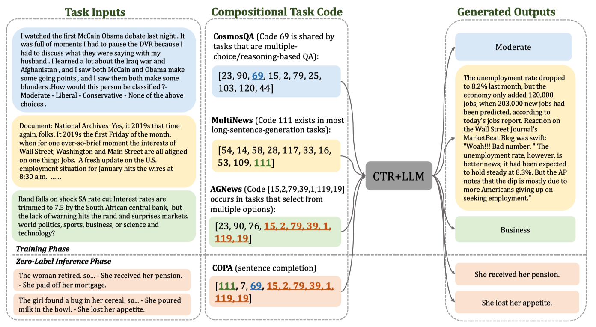
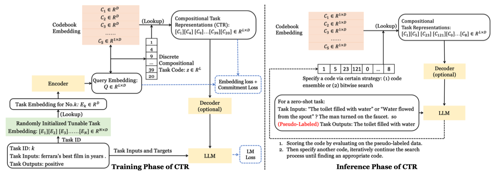

# Compositional Task Representation in Large Language Models

This repository serves primarily as codebase for training, evaluation and inference of CTR.

## Overview



In this paper, we propose the Compositional Task Representations (CTR) method that learns a discrete compositional codebook for tasks and generalizes to new unseen tasks by forming new compositions of the task codes. 
For the inference of CTR, we propose two algorithms - Code Ensemble and Bitwise Search, respectively for zero-label and few-shot settings.



Please find more details of this work in our [paper](https://openreview.net/pdf?id=6axIMJA7ME3).

## Setup

1. Run `git clone https://github.com/shaonan1993/CTR.git` to download the repo.
2. Run `cd CTR` to navigate to root directory of the repo.
3. Build experimental environment:
   * Download Download docker env from [Google Driver](https://drive.google.com/file/d/1GFYZ5psHSGI0XilTOvORa21cQhCcLgwq/view?usp=share_link) or [Baidu Driver](https://pan.baidu.com/s/1tmQ1Ya7gArTvvHiuvhBjXQ?pwd=7es2)
   * run command `sudo docker run -itd --name codebook -v /[YOU_DIR]:/share --gpus all --shm-size 8gb zxdu20/glm-cuda115 /bin/bash`
   * run command `sudo docker exec -it codebook bash`
   * run command `pip install torch-1.11.0+cu115-cp38-cp38-linux_x86_64.whl`
   * run command `pip install transformers==4.15`
   * run command `pip install datasets==1.16`
4. Download processed training data:
   * `cd data`
   * Download `t0_combined_raw_data_no_prompt.zip` from [Google Driver](https://drive.google.com/file/d/1-AP8SseDpH1XaHilSIqjlxT8Kz6dSJT7/view?usp=share_link) or [Baidu Driver](https://pan.baidu.com/s/1cC9_lnYUn1_-9q8eNtvCZQ?pwd=6hbh)
   * Download `t0_combined_raw_data.zip` from [Google Driver](https://drive.google.com/file/d/1NF930SPKTN6MxikBlBBmXzz75dWsdaO0/view?usp=share_link) or [Baidu Driver](https://pan.baidu.com/s/14BF4hc97RvI5NLa_vEvrMA?pwd=w2tj)
   * `unzip t0_combined_raw_data_no_prompt.zip`
   * `unzip t0_combined_raw_data.zip`
5. Download and preprocess pretrained model:
   * `cd pretrained_models`
   * Download [t5-large-lm-adapt](https://huggingface.co/google/t5-large-lm-adapt)
   * `cd ../`
   * `python utils/move_t5.py`
6. (Optional) Download our existing checkpoint from [Google Driver](https://drive.google.com/file/d/13NVoh7SKDrLb8JjsDpwN0JmyzvbLM8iB/view?usp=share_link) or [Baidu Driver](https://pan.baidu.com/s/11YAhF8WZPkKSZTex7eKDPw?pwd=2tjf)
7. (Optional) Download our generated P3 dataset:
   * Manual Prompt Version: [Baidu Driver](https://pan.baidu.com/s/1ZzK7uSgejCoEhTMyhm2xyA?pwd=6xcp)
   * No Prompt Version(inputs are a direct concatenation of multiple text fields): [Baidu Driver](https://pan.baidu.com/s/1ZlANCboti59V1g-MuRD9hQ?pwd=8dka)
   * Note our generated P3 dataset is slight different from original [P3](https://huggingface.co/datasets/bigscience/P3) dataset. We remove some unused dataset, drop duplicate examples and fix some bugs.

**Tips**: We highly recommend everyone to run our code in the same experimental environment, or the results may unexpected due to the loss of precision derived from bfloat16.

## Training&Evaluating T0-Large Baseline

1. Run `sh scripts/run_pretrain_t0_large.sh` to train a T0-Large baseline from scratch.
2. Run `sh scripts/run_eval_t0_large.sh` to evaluate the T0-Large baseline.
3. Run `python stat_result.py` to print all results in your terminal.


Note: For T0-Large baseline, we use the same task prompts from [PromptSource](https://github.com/bigscience-workshop/promptsource).

## Training CTR

1. Run `sh scripts/run_pretrain_t0_vae_large_no_prompt.sh` to train CTR for the first stage.
2. Run `sh scripts/run_pretrain_t0_vae_large_no_prompt_pipe.sh`  to train CTR for the second stage.

Note: 
* For model with CTR, we do not use manual prompt.
* If you want to generate you P3 dataset from scratch, please refer to `./utils/preprocess_for_P3.py`(not recommend, extremely tedious and time-consuming).

## Evaluate CTR
### Code Ensemble for Zero-Label Learning

Run `sh scripts/run_zerolabel_t0_vae_large_no_prompt.sh` to select a task code with the highest pseudo-label accuracy.

## Bitwise Search for Few-Shot Learning.

1. Run `sh scripts/run_fewshot_discrete_search.sh` to find best task code of train tasks.
2. Run `sh scripts/run_fewshot_bitwise_search.sh` select the task code with the minimal loss at first step as an initialization, and then bitwise search a better task code.


## Citation

If you find this resource useful, please cite the paper introducing CTR:

```bibtex
@inproceedings{
shao2023compositional,
title={Compositional Task Representations for Large Language Models},
author={NAN SHAO and Zefan Cai and Hanwei xu and Chonghua Liao and Yanan Zheng and Zhilin Yang},
booktitle={The Eleventh International Conference on Learning Representations },
year={2023},
url={https://openreview.net/forum?id=6axIMJA7ME3}
}
```
